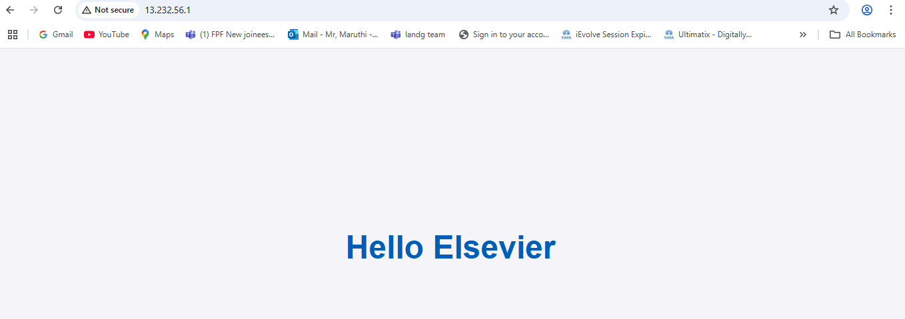

# Terraform EC2 Web Server with CloudWatch Monitoring

This repository contains Terraform code to provision an **EC2 instance** on AWS, deploy a simple web server (Apache) that serves a "Hello Elsevier" page, and  enable **CloudWatch monitoring** for **CPU** and **memory** utilization.

## Table of Contents
- [Overview](#overview)
- [Prerequisites](#prerequisites)
- [Setup Instructions](#setup-instructions)
  - [Clone the Repository](#clone-the-repository)
  - [Install Terraform](#install-terraform)
  - [Deploy Infrastructure](#deploy-infrastructure)
  - [Access the Web Server](#access-the-web-server)
  - [Enable CloudWatch Monitoring](#enable-cloudwatch-monitoring)
- [Cleanup](#cleanup)

## Overview
This project uses **Terraform** to spin up an **EC2 instance** with the following features:
- A **security group** that allows **HTTP (port 80)** and **SSH (port 22)** traffic.
- An **Apache web server** serving a "Hello, World!" page.
- **CloudWatch monitoring** for **CPU** utilization and **memory** (using CloudWatch Agent).

## Prerequisites
Before proceeding with the setup, make sure you have the following:
1. **AWS Account** with appropriate permissions to create EC2 instances and manage resources.
2. **Terraform** installed on your local machine.
   - Install Terraform: [Terraform Installation Guide](https://learn.hashicorp.com/tutorials/terraform/install-cli).
3. **AWS CLI** installed and configured with your AWS credentials.
   - Configure AWS CLI: [AWS CLI Configuration](https://docs.aws.amazon.com/cli/latest/userguide/cli-configure-quickstart.html).
4. **SSH Key Pair** for EC2 access (you can create one from the AWS Console if you don't have one).

## Setup Instructions

### Clone the Repository

1. Clone this repository to your local machine:

   ```bash
   git clone https://github.com/MaruthiMR/DevOps-Engineer-Candidate-Exercise-.git
   cd DevOps-Engineer-Candidate-Exercise

2. Install Terraform if you haven't already. You can follow the instructions for your OS on the official Terraform website:

[Terraform Installation Guide](https://learn.hashicorp.com/tutorials/terraform/install-cli).

3. Once installed, confirm by checking the Terraform version:

   ```bash
   terraform version

4. Initialize Terraform to download the necessary provider plugins:

   ```bash
   terraform init

5. Validate the terraform script to check any miss configurations:

   ```bash
   terraform validate

6. Apply Terraform configuration to create the EC2 instance and other resources:

   ```bash
   terraform apply

7. When prompted, type yes to approve the creation of the resources. 

   Terraform will create:

    a) An EC2 instance with a public IP address.

    

    b) A security group that allows inbound HTTP (port 80) and SSH (port 22) traffic.

    

8. Access the Web Server
  Once the EC2 instance is created, you can access the "Hello Elsevier" page hosted on the web server:
  Retrieve the public IP address of the EC2 instance:

      ```bash
   terraform output instance_public_ip

9. Open a web browser and visit the IP address. You should see the "Hello Elsevier" page.


10. To view the metrics in CloudWatch:

11. Go to the CloudWatch Console.

Choose EC2 to see the metrics like CPU utilization utilization(it will show the some basic metrics, for adanvace metric cllection we have to deploy the cloudwatchagent to our EC2).


12. Cleanup

To avoid unnecessary charges, make sure to destroy the Terraform-managed resources after you're done.

Run the following command to destroy the infrastructure:

       ```bash
    terraform destory


